# ChillCube Godot Addons

This is a library of addons that we at ChillCube use for making our games. 
These libraries are made publicly available, and can therefore be used by anyone. 
It is recommended to use ChillCube's internal developer tools to download and use these libraries, 
but if that is not an option for you, you can download them manually. Just make sure you download any dependencies needed as well!

---

## 🎮 Core Systems
* [State](https://github.com/ChillCube/State) - A godot addon that adds a state node, which can be used as a base for creating state nodes
* [SpriteHelper](https://github.com/ChillCube/SpriteHelper) - A bunch of helper function for managing sprite2D's in godot
* [LabelHelper](https://github.com/ChillCube/LabelHelper) - Functions that are useful for dealing with text and labels
* [Godot_Grid](https://github.com/ChillCube/Godot_Grid) - An addon that manages grid placement. Useful for card games, strategy games, among others
* [TopDownMovement](https://github.com/ChillCube/TopDownMovement) - A godot addon used to create top down movement. Can be used for both player characters and NPCs

## 🕹️ Character Controllers
* [Godot_VehicleController2D](https://github.com/ChillCube/Godot_VehicleController2D) - A character controller for vehicles in 2D (top down)
* [Godot_PlatformerCharacterController](https://github.com/ChillCube/Godot_PlatformerCharacterController) - A simple character controller for platformer games in Godot

## 🧠 AI & Pathfinding
* [HuntingBehaviour](https://github.com/ChillCube/HuntingBehaviour) - an addon to create hunting behaviour on a node

## 🌐 Networking
* [SteamLobbyList](https://github.com/ChillCube/SteamLobbyList) - A node to display a list of lobbies with buttons to select them
* [ChillSteamPlugin](https://github.com/ChillCube/ChillSteamPlugin) - A custom version of the GodotSteam plugin, made to be comptaible with ChillCube's developer tools and made with specific features for ChillCube

## 🖥️ UI & Menus
* [heart_popup](https://github.com/ChillCube/heart_popup) - a node that can be attached and used to display how much health something has, can work with other stats too
* [Godot_StatusBar](https://github.com/ChillCube/Godot_StatusBar) - An addon that can be used to display custom status bars, like healthbars, xp bars, etc in your godot game.
* [2D_Node_Arranger](https://github.com/ChillCube/2d_node_arranger) - A node that you can use to arrange node in certain patterns. Useful for UI elements, cards for a card game, etc
* [Godot_SpriteBasedSmoothMenuButton2D](https://github.com/ChillCube/Godot_SpriteBasedSmoothMenuButton2D) - A different way of handling menu buttons, rather than using control nodes. This can be useful for animations among others

## ⚔️ Combat & Abilities

## 📦 Inventory & Items
* [BurneableObject](https://github.com/ChillCube/BurneableObject) - An addon used for burneable objects. This is used for a campfire sim project we are working on

## 🗺️ World & Level Management

## 🎵 Audio Management

## 📊 Saving & Loading

## ⚙️ Settings & Configuration

## ✨ Polish & Juice

## 🎬 Camera Systems

## 📝 Dialogue & Quests

## 🧩 Procedural Generation

## 🔧 Editor Tools

## 🤝 Multiplayer (Local & Online)

## 🎴 Card Game Systems
* [PlacementArea2D](https://github.com/ChillCube/PlacementArea2D) - a node that lets you define areas to place objects (like cards) onto the screen
* [Deck of Nodes](https://github.com/ChillCube/Deck_of_Nodes) - An addon for managing a list of nodes. Useful for card games
* [Card Hand](https://github.com/ChillCube/Card_Hand) - a godot addon that lets you create a deck of cards. Used for Card2D node
* [2dCard](https://github.com/ChillCube/2dCard) - A node that can be used to create 2D cards for card games

## 💰 Economy & Shops

## 🏆 Progression & Achievements
* [Godot_LevelUp-Stats-and-EXP-system](https://github.com/ChillCube/Godot_LevelUp-Stats-and-EXP-system) - A system for level ups, stats and exp for godot

## 🎨 Visual Effects (Shaders/VFX)

<!-- DEPENDENCY-TREE-START -->
## 🌳 Dependency Tree

```mermaid
flowchart TD
    n_2D_Node_Arranger["2D_Node_Arranger"]
    Godot_2D_Mouse_Dragging["Godot_2D_Mouse_Dragging"]
    SpriteHelper["SpriteHelper"]
    ChillSteamPlugin["ChillSteamPlugin"]
    BurneableObject["BurneableObject"]
    Godot_TopDown_Character_Controller["Godot_TopDown_Character_Controller"]
    n_2d_node_arranger["2d_node_arranger"]
    LabelHelper["LabelHelper"]
    PlacementArea2D["PlacementArea2D"]
    Godot_LevelUp_Stats_and_EXP_system["Godot_LevelUp-Stats-and-EXP-system"]
    Godot_SpriteBasedSmoothMenuButton2D["Godot_SpriteBasedSmoothMenuButton2D"]
    SteamLobbyList["SteamLobbyList"]
    Deck_of_Nodes["Deck of Nodes"]
    Godot_HitflashAnimation["Godot_HitflashAnimation"]
    n_2dCard["2dCard"]
    Godot_VehicleController2D["Godot_VehicleController2D"]
    Card_Hand["Card Hand"]
    Godot_PlatformerCharacterController["Godot_PlatformerCharacterController"]
    Godot_StatusBar["Godot_StatusBar"]
    SpriteAnimations3D["SpriteAnimations3D"]
    TopDownMovement["TopDownMovement"]
    heart_popup["heart_popup"]
    Godot_Grid["Godot_Grid"]
    Godot_SmoothMovement["Godot_SmoothMovement"]
    n_2dCard --> Godot_SmoothMovement
    n_2dCard --> Godot_2D_Mouse_Dragging
    n_2dCard --> Card_Hand
    n_2dCard --> Godot_Grid
    n_2D_Node_Arranger --> Godot_SmoothMovement
    Card_Hand --> n_2d_node_arranger
    Card_Hand --> Godot_SmoothMovement
    Godot_SpriteBasedSmoothMenuButton2D --> Godot_SmoothMovement
    Godot_TopDown_Character_Controller --> TopDownMovement
    heart_popup --> Godot_SmoothMovement
    heart_popup --> LabelHelper
    heart_popup --> SpriteHelper
    PlacementArea2D --> Godot_2D_Mouse_Dragging
    SteamLobbyList --> ChillSteamPlugin
    SteamLobbyList --> n_2d_node_arranger
    SteamLobbyList --> Godot_SpriteBasedSmoothMenuButton2D
    click n_2D_Node_Arranger href "https://github.com/ChillCube/2d_node_arranger" _blank
    click Godot_2D_Mouse_Dragging href "https://github.com/ChillCube/Godot_2D_Mouse_Dragging" _blank
    click SpriteHelper href "https://github.com/ChillCube/SpriteHelper" _blank
    click ChillSteamPlugin href "https://github.com/ChillCube/ChillSteamPlugin" _blank
    click BurneableObject href "https://github.com/ChillCube/BurneableObject" _blank
    click Godot_TopDown_Character_Controller href "https://github.com/ChillCube/Godot_TopDown_Character_Controller" _blank
    click n_2d_node_arranger href "https://github.com/ChillCube/2d_node_arranger" _blank
    click LabelHelper href "https://github.com/ChillCube/LabelHelper" _blank
    click PlacementArea2D href "https://github.com/ChillCube/PlacementArea2D" _blank
    click Godot_LevelUp_Stats_and_EXP_system href "https://github.com/ChillCube/Godot_LevelUp-Stats-and-EXP-system" _blank
    click Godot_SpriteBasedSmoothMenuButton2D href "https://github.com/ChillCube/Godot_SpriteBasedSmoothMenuButton2D" _blank
    click SteamLobbyList href "https://github.com/ChillCube/SteamLobbyList" _blank
    click Deck_of_Nodes href "https://github.com/ChillCube/Deck_of_Nodes" _blank
    click Godot_HitflashAnimation href "https://github.com/ChillCube/Godot_HitflashAnimation" _blank
    click n_2dCard href "https://github.com/ChillCube/2dCard" _blank
    click Godot_VehicleController2D href "https://github.com/ChillCube/Godot_VehicleController2D" _blank
    click Card_Hand href "https://github.com/ChillCube/Card_Hand" _blank
    click Godot_PlatformerCharacterController href "https://github.com/ChillCube/Godot_PlatformerCharacterController" _blank
    click Godot_StatusBar href "https://github.com/ChillCube/Godot_StatusBar" _blank
    click SpriteAnimations3D href "https://github.com/ChillCube/SpriteAnimations3D" _blank
    click TopDownMovement href "https://github.com/ChillCube/TopDownMovement" _blank
    click heart_popup href "https://github.com/ChillCube/heart_popup" _blank
    click Godot_Grid href "https://github.com/ChillCube/Godot_Grid" _blank
    click Godot_SmoothMovement href "https://github.com/ChillCube/Godot_SmoothMovement" _blank
```

<!-- DEPENDENCY-TREE-END -->
