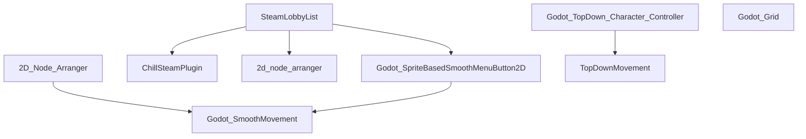

# ChillCube Godot Addons

This is a library of addons that we at ChillCube use for making our games. 
These libraries are made publicly available, and can therefore be used by anyone. 
It is recommended to use ChillCube's internal developer tools to download and use these libraries, 
but if that is not an option for you, you can download them manually. Just make sure you download any dependencies needed as well!

---

## 🎮 Core Systems
* [Godot_Grid](https://github.com/ChillCube/Godot_Grid) - An addon that manages grid placement. Useful for card games, strategy games, among others
* [TopDownMovement](https://github.com/ChillCube/TopDownMovement) - A godot addon used to create top down movement. Can be used for both player characters and NPCs

## 🕹️ Character Controllers

## 🧠 AI & Pathfinding

## 🌐 Networking
* [SteamLobbyList](https://github.com/ChillCube/SteamLobbyList) - A node to display a list of lobbies with buttons to select them
* [ChillSteamPlugin](https://github.com/ChillCube/ChillSteamPlugin) - A custom version of the GodotSteam plugin, made to be comptaible with ChillCube's developer tools and made with specific features for ChillCube

## 🖥️ UI & Menus
* [2D_Node_Arranger](https://github.com/ChillCube/2d_node_arranger) - A node that you can use to arrange node in certain patterns. Useful for UI elements, cards for a card game, etc
* [Godot_SpriteBasedSmoothMenuButton2D](https://github.com/ChillCube/Godot_SpriteBasedSmoothMenuButton2D) - A different way of handling menu buttons, rather than using control nodes. This can be useful for animations among others

## ⚔️ Combat & Abilities

## 📦 Inventory & Items
* [BurneableObject](https://github.com/ChillCube/BurneableObject) - An addon used for burneable objects. This is used for a campfire sim project we are working on

## 🗺️ World & Level Management

## 🎵 Audio Management

## 📊 Saving & Loading

## ⚙️ Settings & Configuration

## ✨ Polish & Juice

## 🎬 Camera Systems

## 📝 Dialogue & Quests

## 🧩 Procedural Generation

## 🔧 Editor Tools

## 🤝 Multiplayer (Local & Online)

## 🎴 Card Game Systems
* [Deck of Nodes](https://github.com/ChillCube/Deck_of_Nodes) - An addon for managing a list of nodes. Useful for card games
* [Card Hand](https://github.com/ChillCube/Card_Hand) - a godot addon that lets you create a deck of cards. Used for Card2D node
* [2dCard](https://github.com/ChillCube/2dCard) - A node that can be used to create 2D cards for card games

## 💰 Economy & Shops

## 🏆 Progression & Achievements

## 🎨 Visual Effects (Shaders/VFX)

<!-- DEPENDENCY-TREE-START -->
## 🌳 Dependency Tree

<!-- DEPENDENCY-TREE-END -->
