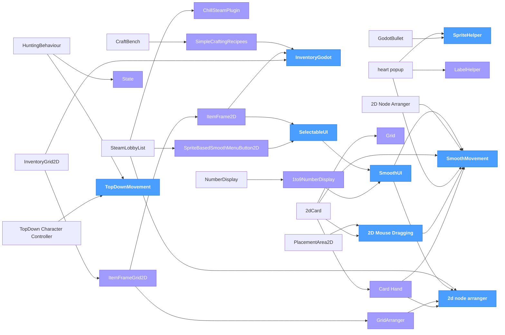

# ChillCube Godot Addons

This is a library of addons that we at ChillCube use for making our games. 
These libraries are made publicly available, and can therefore be used by anyone. 
It is recommended to use ChillCube's internal developer tools to download and use these libraries, 
but if that is not an option for you, you can download them manually. Just make sure you download any dependencies needed as well!

---

## 🎮 Core Systems
* [GridArranger](https://github.com/ChillCube/GridArranger) - Arranges and creates nodes in a grid
* [Godot_SmoothMovement](https://github.com/ChillCube/Godot_SmoothMovement) - A godot addon that enables smooth movement on a node using a global_target_position variable
* [Godot_2D_Mouse_Dragging](https://github.com/ChillCube/Godot_2D_Mouse_Dragging) - A godot addon that makes any object draggable with the mouse by adding it as a child node
* [State](https://github.com/ChillCube/State) - A godot addon that adds a state node, which can be used as a base for creating state nodes
* [SpriteHelper](https://github.com/ChillCube/SpriteHelper) - A bunch of helper function for managing sprite2D's in godot
* [LabelHelper](https://github.com/ChillCube/LabelHelper) - Functions that are useful for dealing with text and labels
* [Godot_Grid](https://github.com/ChillCube/Godot_Grid) - An addon that manages grid placement. Useful for card games, strategy games, among others
* [TopDownMovement](https://github.com/ChillCube/TopDownMovement) - A godot addon used to create top down movement. Can be used for both player characters and NPCs

## 🕹️ Character Controllers
* [Godot_TopDown_Character_Controller](https://github.com/ChillCube/Godot_TopDown_Character_Controller) - A character controller for top down movement, such as for an RPG game
* [Godot_VehicleController2D](https://github.com/ChillCube/Godot_VehicleController2D) - A character controller for vehicles in 2D (top down)
* [Godot_PlatformerCharacterController](https://github.com/ChillCube/Godot_PlatformerCharacterController) - A simple character controller for platformer games in Godot

## 🧠 AI & Pathfinding
* [HuntingBehaviour](https://github.com/ChillCube/HuntingBehaviour) - an addon to create hunting behaviour on a node

## 🌐 Networking
* [SteamLobbyList](https://github.com/ChillCube/SteamLobbyList) - A node to display a list of lobbies with buttons to select them
* [ChillSteamPlugin](https://github.com/ChillCube/ChillSteamPlugin) - A custom version of the GodotSteam plugin, made to be comptaible with ChillCube's developer tools and made with specific features for ChillCube

## 🖥️ UI & Menus
* [SelectableUI](https://github.com/ChillCube/SelectableUI) - an addon that manages selectable UI elements in godot
* [1to9NumberDisplay](https://github.com/ChillCube/1to9NumberDisplay) - A godot class that displays a number from 1 to 9
* [NumberDisplay](https://github.com/ChillCube/NumberDisplay) - A way to display numbers based on custom sprites on the screen in Godot
* [InventoryGrid2D](https://github.com/ChillCube/InventoryGrid2D) - A 2D inventory grid in godot
* [SmoothUI](https://github.com/ChillCube/SmoothUI) - A base node for smooth UI nodes used by ChillCube
* [ItemFrame2D](https://github.com/ChillCube/ItemFrame2D) - A node to visualize items on the screen, useful for inventory UI
* [heart_popup](https://github.com/ChillCube/heart_popup) - a node that can be attached and used to display how much health something has, can work with other stats too
* [Godot_StatusBar](https://github.com/ChillCube/Godot_StatusBar) - An addon that can be used to display custom status bars, like healthbars, xp bars, etc in your godot game.
* [2D_Node_Arranger](https://github.com/ChillCube/2d_node_arranger) - A node that you can use to arrange node in certain patterns. Useful for UI elements, cards for a card game, etc
* [Godot_SpriteBasedSmoothMenuButton2D](https://github.com/ChillCube/Godot_SpriteBasedSmoothMenuButton2D) - A different way of handling menu buttons, rather than using control nodes. This can be useful for animations among others

## ⚔️ Combat & Abilities
* [GodotBullet](https://github.com/ChillCube/GodotBullet) - A flexible bullet Node for Godot

## 📦 Inventory & Items
* [ItemFrameGrid2D](https://github.com/ChillCube/ItemFrameGrid2D) - A node for displaying a grid of item frames
* [CraftBench](https://github.com/ChillCube/CraftBench) - A godot Node for managing live crafting
* [SimpleCraftingRecipees](https://github.com/ChillCube/SimpleCraftingRecipees) - A simple addon that provides a custom resource to save crafting recipees
* [InventoryGodot](https://github.com/ChillCube/InventoryGodot) - Provides an inventory and item resource used for inventory management
* [BurneableObject](https://github.com/ChillCube/BurneableObject) - An addon used for burneable objects. This is used for a campfire sim project we are working on

## 🗺️ World & Level Management

## 🎵 Audio Management

## 📊 Saving & Loading

## ⚙️ Settings & Configuration

## ✨ Polish & Juice
* [SpriteAnimations3D](https://github.com/ChillCube/SpriteAnimations3D) - A set of animations that can be used on 3D sprites
* [Godot_HitflashAnimation](https://github.com/ChillCube/Godot_HitflashAnimation) - A godot addon that can be used to apply hitlfash animations to nodes

## 🎬 Camera Systems

## 📝 Dialogue & Quests

## 🧩 Procedural Generation

## 🔧 Editor Tools

## 🤝 Multiplayer (Local & Online)

## 🎴 Card Game Systems
* [PlacementArea2D](https://github.com/ChillCube/PlacementArea2D) - a node that lets you define areas to place objects (like cards) onto the screen
* [Deck of Nodes](https://github.com/ChillCube/Deck_of_Nodes) - An addon for managing a list of nodes. Useful for card games
* [Card Hand](https://github.com/ChillCube/Card_Hand) - a godot addon that lets you create a deck of cards. Used for Card2D node
* [2dCard](https://github.com/ChillCube/2dCard) - A node that can be used to create 2D cards for card games

## 💰 Economy & Shops
* [CurrencyGodot](https://github.com/ChillCube/CurrencyGodot) - A custom resource meant to help create economic simulations for fantasy currencies

## 🏆 Progression & Achievements
* [Godot_LevelUp-Stats-and-EXP-system](https://github.com/ChillCube/Godot_LevelUp-Stats-and-EXP-system) - A system for level ups, stats and exp for godot

## 🎨 Visual Effects (Shaders/VFX)

<!-- DEPENDENCY-TREE-START -->
## 🌳 Dependency Tree

**Standalone addons:** [BurneableObject](https://github.com/ChillCube/BurneableObject) · [CurrencyGodot](https://github.com/ChillCube/CurrencyGodot) · [Deck of Nodes](https://github.com/ChillCube/Deck_of_Nodes) · [HitflashAnimation](https://github.com/ChillCube/Godot_HitflashAnimation) · [LevelUp-Stats-and-EXP-system](https://github.com/ChillCube/Godot_LevelUp-Stats-and-EXP-system) · [PlatformerCharacterController](https://github.com/ChillCube/Godot_PlatformerCharacterController) · [StatusBar](https://github.com/ChillCube/Godot_StatusBar) · [VehicleController2D](https://github.com/ChillCube/Godot_VehicleController2D) · [SpriteAnimations3D](https://github.com/ChillCube/SpriteAnimations3D)
<!-- DEPENDENCY-TREE-END -->
