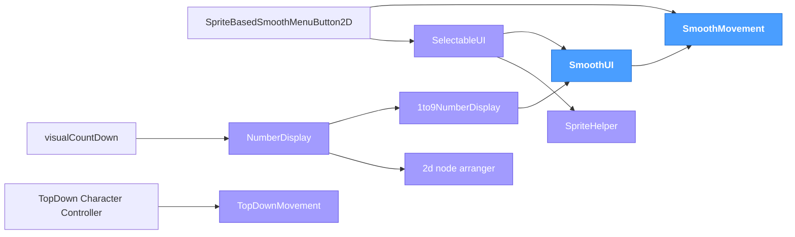

# ChillCube Godot Addons

This is a library of addons that we at ChillCube use for making our games. 
These libraries are made publicly available, and can therefore be used by anyone. 
It is recommended to use ChillCube's internal developer tools to download and use these libraries, 
but if that is not an option for you, you can download them manually. Just make sure you download any dependencies needed as well!

---

## 🎮 Core Systems
* [TurnManager](https://github.com/ChillCube/TurnManager) - A node for managing turns in a turn based game
* [MouseMovableCamera](https://github.com/ChillCube/MouseMovableCamera) - A camera that can be moved with the mouse
* [SimpleTeamColourSprite](https://github.com/ChillCube/SimpleTeamColourSprite) - A simple sprite node that will adapts its colours based on what team it is set to be.
* [TeamColours](https://github.com/ChillCube/TeamColours) - A resource that lets you define team colours for a game
* [ArrowVisualizer](https://github.com/ChillCube/ArrowVisualizer) - A node for displaying arrows on the screen
* [CalendarResource](https://github.com/ChillCube/CalendarResource) - Resources for creating fantasy calendar systems
* [Gun2D](https://github.com/ChillCube/Gun2D) - A Gun2D node that lets you fire different types of bullets towards the mouse
* [AttractedObject2D](https://github.com/ChillCube/AttractedObject2D) - A node in godot that is attracted to a predefined other Node and will move towards it. Useful for games where the player collects coins, experience or items
* [SaveManager](https://github.com/ChillCube/SaveManager) - A save manager class for godot
* [SpritePlacement](https://github.com/ChillCube/SpritePlacement) - A node for placing objects onto a sprite
* [PlaceAbleItem2D](https://github.com/ChillCube/PlaceAbleItem2D) - A node for placeable items, useful for rearranging items in inventory or for crafting systems
* [PlaceAbleObject2D](https://github.com/ChillCube/PlaceAbleObject2D) - A node that for object placement in Godot
* [GridArranger](https://github.com/ChillCube/GridArranger) - Arranges and creates nodes in a grid
* [Godot_SmoothMovement](https://github.com/ChillCube/Godot_SmoothMovement) - A godot addon that enables smooth movement on a node using a global_target_position variable
* [Godot_2D_Mouse_Dragging](https://github.com/ChillCube/Godot_2D_Mouse_Dragging) - A godot addon that makes any object draggable with the mouse by adding it as a child node
* [State](https://github.com/ChillCube/State) - A godot addon that adds a state node, which can be used as a base for creating state nodes
* [SpriteHelper](https://github.com/ChillCube/SpriteHelper) - A bunch of helper function for managing sprite2D's in godot
* [LabelHelper](https://github.com/ChillCube/LabelHelper) - Functions that are useful for dealing with text and labels
* [Godot_Grid](https://github.com/ChillCube/Godot_Grid) - An addon that manages grid placement. Useful for card games, strategy games, among others
* [TopDownMovement](https://github.com/ChillCube/TopDownMovement) - A godot addon used to create top down movement. Can be used for both player characters and NPCs

## 🕹️ Character Controllers
* [SaveManager](https://github.com/ChillCube/SaveManager) - A save manager class for godot
* [Godot_TopDown_Character_Controller](https://github.com/ChillCube/Godot_TopDown_Character_Controller) - A character controller for top down movement, such as for an RPG game
* [Godot_VehicleController2D](https://github.com/ChillCube/Godot_VehicleController2D) - A character controller for vehicles in 2D (top down)
* [Godot_PlatformerCharacterController](https://github.com/ChillCube/Godot_PlatformerCharacterController) - A simple character controller for platformer games in Godot

## 🧠 AI & Pathfinding
* [SaveManager](https://github.com/ChillCube/SaveManager) - A save manager class for godot
* [HuntingBehaviour](https://github.com/ChillCube/HuntingBehaviour) - an addon to create hunting behaviour on a node

## 🌐 Networking
* [SaveManager](https://github.com/ChillCube/SaveManager) - A save manager class for godot
* [SteamLobbyList](https://github.com/ChillCube/SteamLobbyList) - A node to display a list of lobbies with buttons to select them
* [ChillSteamPlugin](https://github.com/ChillCube/ChillSteamPlugin) - A custom version of the GodotSteam plugin, made to be comptaible with ChillCube's developer tools and made with specific features for ChillCube

## 🖥️ UI & Menus
* [TimeUnitDisplay2D](https://github.com/ChillCube/TimeUnitDisplay2D) - Displays one specific time unit, those being hours, minutes and seconds.
* [SaveManager](https://github.com/ChillCube/SaveManager) - A save manager class for godot
* [visualCountDown](https://github.com/ChillCube/visualCountDown) - a node that will display a countdown on screen
* [SelectableUI](https://github.com/ChillCube/SelectableUI) - an addon that manages selectable UI elements in godot
* [1to9NumberDisplay](https://github.com/ChillCube/1to9NumberDisplay) - A godot class that displays a number from 1 to 9
* [NumberDisplay](https://github.com/ChillCube/NumberDisplay) - A way to display numbers based on custom sprites on the screen in Godot
* [InventoryGrid2D](https://github.com/ChillCube/InventoryGrid2D) - A 2D inventory grid in godot
* [SmoothUI](https://github.com/ChillCube/SmoothUI) - A base node for smooth UI nodes used by ChillCube
* [ItemFrame2D](https://github.com/ChillCube/ItemFrame2D) - A node to visualize items on the screen, useful for inventory UI
* [heart_popup](https://github.com/ChillCube/heart_popup) - a node that can be attached and used to display how much health something has, can work with other stats too
* [Godot_StatusBar](https://github.com/ChillCube/Godot_StatusBar) - An addon that can be used to display custom status bars, like healthbars, xp bars, etc in your godot game.
* [2D_Node_Arranger](https://github.com/ChillCube/2d_node_arranger) - A node that you can use to arrange node in certain patterns. Useful for UI elements, cards for a card game, etc
* [Godot_SpriteBasedSmoothMenuButton2D](https://github.com/ChillCube/Godot_SpriteBasedSmoothMenuButton2D) - A different way of handling menu buttons, rather than using control nodes. This can be useful for animations among others

## ⚔️ Combat & Abilities
* [DamageFormula](https://github.com/ChillCube/DamageFormula) - A resource for allowing calculation of damage in different ways.
* [HealthAndDamageArea](https://github.com/ChillCube/HealthAndDamageArea) - A node that can be added to an enemy or npc that will manage damage and health.
* [DamageReceiver](https://github.com/ChillCube/DamageReceiver) - A node that you can add as a child of something that can receive damage. It will check for any damage received and send a signal to communicate the damage.
* [SaveManager](https://github.com/ChillCube/SaveManager) - A save manager class for godot
* [GodotBullet](https://github.com/ChillCube/GodotBullet) - A flexible bullet Node for Godot

## 📦 Inventory & Items
* [StorageNode](https://github.com/ChillCube/StorageNode) - A node that is used to store items in it
* [SaveManager](https://github.com/ChillCube/SaveManager) - A save manager class for godot
* [InventoryManagerGrid](https://github.com/ChillCube/InventoryManagerGrid) - A 2D inventory grid
* [InventoryFrame2D](https://github.com/ChillCube/InventoryFrame2D) - A node for displaying and managing a specific inventory slot and its item
* [ItemFrameGrid2D](https://github.com/ChillCube/ItemFrameGrid2D) - A node for displaying a grid of item frames
* [CraftBench](https://github.com/ChillCube/CraftBench) - A godot Node for managing live crafting
* [SimpleCraftingRecipees](https://github.com/ChillCube/SimpleCraftingRecipees) - A simple addon that provides a custom resource to save crafting recipees
* [InventoryGodot](https://github.com/ChillCube/InventoryGodot) - Provides an inventory and item resource used for inventory management
* [BurneableObject](https://github.com/ChillCube/BurneableObject) - An addon used for burneable objects. This is used for a campfire sim project we are working on

## 🗺️ World & Level Management
* [SaveManager](https://github.com/ChillCube/SaveManager) - A save manager class for godot

## 🎵 Audio Management
* [SaveManager](https://github.com/ChillCube/SaveManager) - A save manager class for godot

## 📊 Saving & Loading
* [SaveManager](https://github.com/ChillCube/SaveManager) - A save manager class for godot

## ⚙️ Settings & Configuration
* [SaveManager](https://github.com/ChillCube/SaveManager) - A save manager class for godot

## ✨ Polish & Juice
* [SaveManager](https://github.com/ChillCube/SaveManager) - A save manager class for godot
* [SpriteAnimations3D](https://github.com/ChillCube/SpriteAnimations3D) - A set of animations that can be used on 3D sprites
* [Godot_HitflashAnimation](https://github.com/ChillCube/Godot_HitflashAnimation) - A godot addon that can be used to apply hitlfash animations to nodes

## 🎬 Camera Systems
* [FollowingCamera2D](https://github.com/ChillCube/FollowingCamera2D) - A camera node that lets you simply pick a node and have the camera track the position of that node
* [SaveManager](https://github.com/ChillCube/SaveManager) - A save manager class for godot

## 📝 Dialogue & Quests
* [Letter-instance](https://github.com/ChillCube/Letter-instance) - A scene that is used in a strategy game prototype for showing and managing letters
* [SaveManager](https://github.com/ChillCube/SaveManager) - A save manager class for godot

## 🧩 Procedural Generation
* [ClockResource](https://github.com/ChillCube/ClockResource) - A resource which handles the time of day values.
* [SaveManager](https://github.com/ChillCube/SaveManager) - A save manager class for godot

## 🔧 Editor Tools
* [SaveManager](https://github.com/ChillCube/SaveManager) - A save manager class for godot

## 🤝 Multiplayer (Local & Online)
* [SaveManager](https://github.com/ChillCube/SaveManager) - A save manager class for godot

## 🎴 Card Game Systems
* [SaveManager](https://github.com/ChillCube/SaveManager) - A save manager class for godot
* [PlacementArea2D](https://github.com/ChillCube/PlacementArea2D) - a node that lets you define areas to place objects (like cards) onto the screen
* [Deck of Nodes](https://github.com/ChillCube/Deck_of_Nodes) - An addon for managing a list of nodes. Useful for card games
* [Card Hand](https://github.com/ChillCube/Card_Hand) - a godot addon that lets you create a deck of cards. Used for Card2D node
* [2dCard](https://github.com/ChillCube/2dCard) - A node that can be used to create 2D cards for card games

## 💰 Economy & Shops
* [SaveManager](https://github.com/ChillCube/SaveManager) - A save manager class for godot
* [CurrencyGodot](https://github.com/ChillCube/CurrencyGodot) - A custom resource meant to help create economic simulations for fantasy currencies

## 🏆 Progression & Achievements
* [SaveManager](https://github.com/ChillCube/SaveManager) - A save manager class for godot
* [Godot_LevelUp-Stats-and-EXP-system](https://github.com/ChillCube/Godot_LevelUp-Stats-and-EXP-system) - A system for level ups, stats and exp for godot

## 🎨 Visual Effects (Shaders/VFX)
* [SaveManager](https://github.com/ChillCube/SaveManager) - A save manager class for godot

## Uncategorized
* [CameraLockerArea2D](https://github.com/ChillCube/CameraLockerArea2D) - An Area2D that works with FollowerCamera2D. If the node the camera is following enters this area, the camera will instead lock onto this area, until the node leaves the area.
* [RotateToMouse](https://github.com/ChillCube/RotateToMouse) - A node that rotates its parent towards the mouse. Useful for 2D shooters
* [Rotator2D](https://github.com/ChillCube/Rotator2D) - A node that rotates its parent
* [ChillCube Tools](https://github.com/ChillCube/ChillCube-Developer-Tools) - Manage ChillCube addons directly from the Godot editor — no terminal required.

<!-- DEPENDENCY-TREE-START -->
## 🌳 Dependency Tree

```mermaid
flowchart LR
    classDef core  fill:#4a9eff,stroke:#2471d4,color:#fff,font-weight:bold
    classDef shared fill:#a29bfe,stroke:#6c5ce7,color:#fff

    Godot_SmoothMovement["SmoothMovement"]
    Godot_SpriteBasedSmoothMenuButton2D["SpriteBasedSmoothMenuButton2D"]
    Godot_TopDown_Character_Controller["TopDown Character Controller"]
    n_1to9NumberDisplay["1to9NumberDisplay"]
    n_2d_node_arranger["2d node arranger"]
    NumberDisplay["NumberDisplay"]
    SelectableUI["SelectableUI"]
    SmoothUI["SmoothUI"]
    SpriteHelper["SpriteHelper"]
    TopDownMovement["TopDownMovement"]
    visualCountDown["visualCountDown"]

    Godot_SpriteBasedSmoothMenuButton2D --> Godot_SmoothMovement
    Godot_SpriteBasedSmoothMenuButton2D --> SelectableUI
    Godot_TopDown_Character_Controller --> TopDownMovement
    n_1to9NumberDisplay --> SmoothUI
    NumberDisplay --> n_1to9NumberDisplay
    NumberDisplay --> n_2d_node_arranger
    SelectableUI --> SmoothUI
    SelectableUI --> SpriteHelper
    SmoothUI --> Godot_SmoothMovement
    visualCountDown --> NumberDisplay

    class Godot_SmoothMovement core
    class n_1to9NumberDisplay shared
    class n_2d_node_arranger shared
    class NumberDisplay shared
    class SelectableUI shared
    class SmoothUI core
    class SpriteHelper shared
    class TopDownMovement shared

    click Godot_SmoothMovement href "https://github.com/ChillCube/Godot_SmoothMovement" _blank
    click Godot_SpriteBasedSmoothMenuButton2D href "https://github.com/ChillCube/Godot_SpriteBasedSmoothMenuButton2D" _blank
    click Godot_TopDown_Character_Controller href "https://github.com/ChillCube/Godot_TopDown_Character_Controller" _blank
    click n_1to9NumberDisplay href "https://github.com/ChillCube/1to9NumberDisplay" _blank
    click n_2d_node_arranger href "https://github.com/ChillCube/2d_node_arranger" _blank
    click NumberDisplay href "https://github.com/ChillCube/NumberDisplay" _blank
    click SelectableUI href "https://github.com/ChillCube/SelectableUI" _blank
    click SmoothUI href "https://github.com/ChillCube/SmoothUI" _blank
    click SpriteHelper href "https://github.com/ChillCube/SpriteHelper" _blank
    click TopDownMovement href "https://github.com/ChillCube/TopDownMovement" _blank
    click visualCountDown href "https://github.com/ChillCube/visualCountDown" _blank
```

**Standalone addons:** DirectionalAnimatedSprite · InteractableNode · [LabelHelper](https://github.com/ChillCube/LabelHelper) · [2D Node Arranger](https://github.com/ChillCube/2d_node_arranger) · speechbubble
<!-- DEPENDENCY-TREE-END -->
